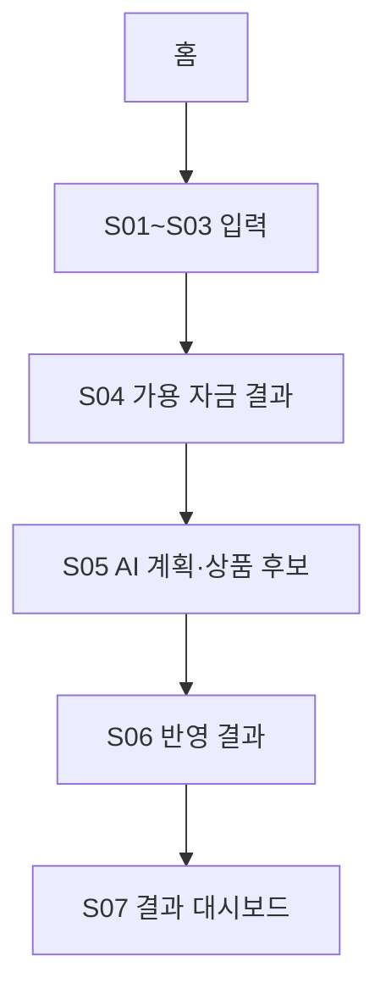

# 제품 범위와 사용자 흐름

## 제품 원칙

핵심은 AI가 아니라 **진짜 가용 자금 계산**이다. AI는 계산 결과를 사용자가 이해하고 활용하도록 돕는 후속 기능으로만 배치한다.

서비스가 답해야 하는 질문은 다음 순서다.

1. 이번 달에 들어올 돈은 얼마인가?
2. 세금·고정비·저축을 제외하면 실제로 얼마를 쓸 수 있는가?
3. 이 돈을 어떤 목적에 얼마나 배분할 수 있는가?
4. 목적에 맞는 저축상품 후보는 무엇인가?

## 대상 사용자

- 월급은 받지만 실제 가용 금액을 매번 따로 계산하는 사회초년생
- 자동 저축과 고정비 이후의 소비 가능액을 한눈에 보고 싶은 사용자
- 가입 없이 빠르게 계산 결과를 체험하고 싶은 공모전 방문자

## 최종 7개 화면

Figma `유경` 페이지의 7개 프레임과 1:1로 대응한다(node 79:2 하위 79:3, 79:100, 79:207, 79:367, 79:467, 79:629, 79:953).

| ID | 화면 | Figma 프레임명 | 핵심 역할 |
| --- | --- | --- | --- |
| S01 | 예산 기간 설정 | 예산 기간 설정 | 월급일(프리셋) 선택과 이번 달 예산 기간 확정 |
| S02 | 소득 입력 | 소득 입력 | 세전 월급/실수령액 입력, 4대보험·소득세 근사 공제 내역과 예상 실수령액 표시 |
| S03 | 고정비·저축 | 고정비, 저축 | 고정비·저축 항목을 리스트(이름+금액)로 입력 |
| S04 | 가용 자금 결과 | 결과 | 가용 자금·하루 예산·계산 근거, AI 계획 진입 카드 (AI 미적용 상태) |
| S05 | AI 활용 계획 및 추천 상품 | AI 활용 계획 및 추천 상품 | 목표 문장 입력, 목표별 배분·조정된 하루 예산, 저축상품 후보 3개 |
| S06 | AI 반영 | AI 반영 | S04와 동일한 결과 화면 + AI 계획 적용 배지·조정된 하루 예산 |
| S07 | 홈 | 홈화면 | 첫 방문 안내 또는 저장된 결과 대시보드 |

`S07 홈`은 하나의 화면 안에서 데이터 유무에 따라 내용만 바뀐다. `S04`와 `S06`도 마찬가지로 `state.plan` 유무에 따라 내용이 바뀌는 사실상 같은 정보 구조의 화면이다. 별도의 빈 홈·작성 중 홈·마이페이지 화면을 추가하지 않는다.

## 핵심 흐름

### 첫 방문

- 홈에는 서비스 한 줄 설명과 `내 가용 자금 계산하기` 버튼을 표시한다.
- CTA 클릭 시 S01로 이동한다.

### 작성 중

- 각 단계 완료 시 값을 즉시 저장한다.
- 홈으로 돌아오거나 새로고침한 경우 CTA 문구를 `이어서 계산하기`로 바꿀 수 있다.
- 작성 중 데이터는 대시보드로 표시하지 않는다.

### 계산 완료

- S04 진입 시 완료 결과를 저장한다.
- 홈은 최근 결과를 요약한 대시보드로 바뀐다.
- 홈의 `이번 달 다시 계산하기`(S04의 `완료` 버튼이 아니라 홈 대시보드의 CTA)는 저장값을 초기화하지 않고 S01에 기존 값을 채운 상태로 연다.

### AI 계획 완료

- S05에서 목표 문장을 입력하고 `계획 세우기`로 배분안·조정된 하루 예산·상품 후보를 확인한다.
- `계획 반영하고 결과로 돌아가기`를 누르면 S06(AI 반영 상태의 결과 화면)과 홈에 같은 계획이 반영된다.

## 범위 밖

- 회원가입, 로그인, 계정 동기화
- 실제 은행 계좌 연결과 결제
- 실시간 금융상품 조회·가입
- 실제 생성형 AI API 호출
- 서버, 데이터베이스, 관리자 화면
- 별도 마이페이지

## 주의 문구

- 예상 실수령액과 가용 자금은 입력값을 기반으로 한 참고용 추정치다. 4대보험·소득세 공제는 실제 누진세율이 아니라 근사 정률로 계산한다(`01_DATA_STATE_CALCULATION.md` 참고).
- 저축상품(토닥은행/새록저축은행/푸른은행 등)은 실재하지 않는 프로토타입용 예시이며 가입 권유나 금융 자문이 아니다. 화면에 "가입 전 실제 조건을 꼭 확인하세요" 안내를 항상 함께 표시한다.
- 브라우저 데이터를 삭제하면 저장된 결과도 사라진다.
- 로그인·계정이 없으므로 특정 사용자 이름을 화면에 하드코딩하지 않는다(Figma 목업의 "유경님" 같은 이름은 실제 구현에서 제외한다).

